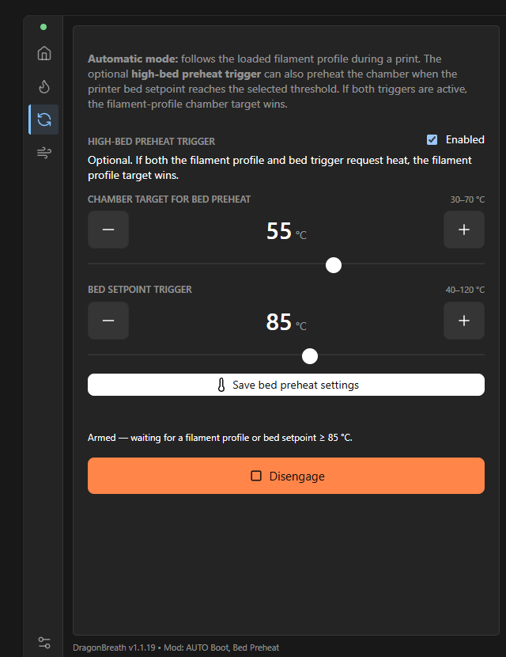
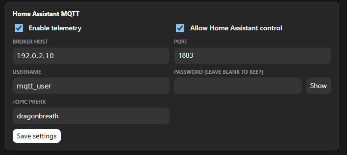
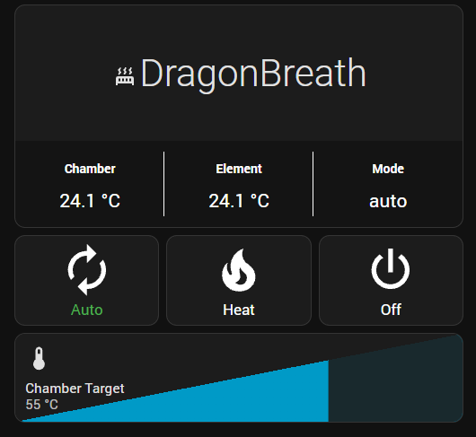
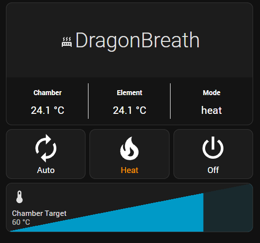
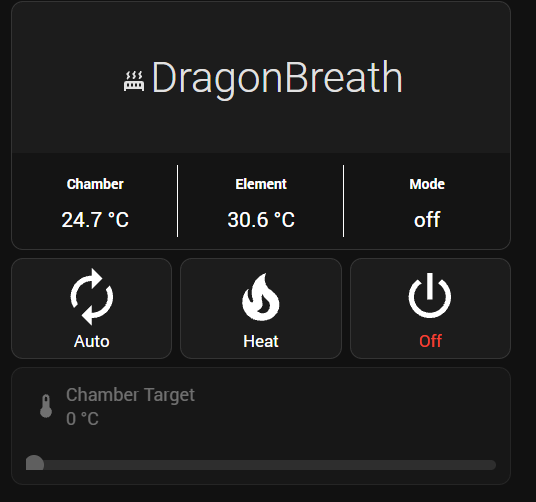
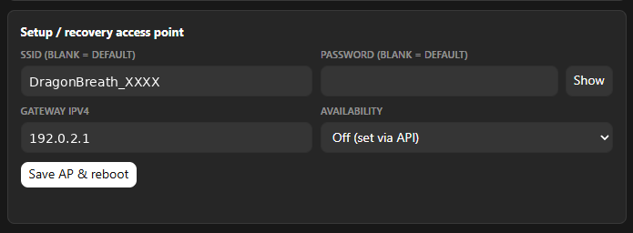

# Felix DragonBreath Customizations (R9)

This fork tracks the upstream DragonBreath project while preserving the custom firmware changes developed and hardware-tested for this installation.

## Source baseline

- Product source baseline: DragonBreath v1.1.19 (`f311a22c39a3e3aef92d10f0f6c3f2d5d63e02b9`).
- The fork branch was prepared on top of the newer upstream documentation commit already present in `main`; the R9 firmware source changes do not overwrite that documentation update.
- ESP-IDF build target: ESP32-C3 with ESP-IDF v5.3.5.
- The customized `dc_ui` is vendored under `components/dc_ui` from `dragon-core` v0.35.2 so a clean clone reproduces the custom web UI without modifying generated `managed_components`.

## Firmware behavior added or changed

### Persistent AUTO preference

The user's explicit AUTO/OFF preference is stored in NVS. If AUTO was armed before a reboot, DragonBreath returns to AUTO after reboot. If the user explicitly selected OFF, it remains OFF after reboot. Safety-driven internal OFF transitions do not erase the user's stored AUTO preference.

### Optional high-bed AUTO preheat trigger

AUTO can request chamber heating from either of two sources:

1. the existing filament-zone target; or
2. an optional high printer-bed setpoint trigger.

The bed trigger is disabled by default, uses a 3 °C hysteresis band, and uses the configured AUTO chamber target. If both the filament profile and bed trigger request heat, the filament-zone target wins. Bambu remains the printer/environment source.

### Bambu + Home Assistant sidecar control

Bambu may remain the selected printer/AUTO source while Home Assistant runs alongside it. The Home Assistant MQTT provisioning section adds two persisted controls:

- **Enable telemetry**
- **Allow Home Assistant control**

With telemetry enabled and control disabled, HA is read-only. With both enabled and Bambu selected, HA may issue OFF, HEAT, and AUTO commands while Bambu continues to supply printer state and AUTO inputs.

### Native Home Assistant climate entity

The native MQTT climate entity is retained with modes `off`, `heat`, and `auto`. Retained discovery topics from the temporary R5 number/select experiment are explicitly cleared so installations return to the native climate entity.

### Target-slider semantics

The final R9 target-command behavior is:

- **AUTO + target change:** update/persist the AUTO target and remain in AUTO. The change does not create a manual HEAT lease. Actual heater demand is still determined by the normal AUTO conditions.
- **HEAT + target change:** update the manual heat target and remain in HEAT.
- **OFF + target change:** update/persist the remembered manual target only. Mode remains OFF; no heater demand or control lease is created.

Home Assistant receives the remembered manual target while the device is OFF, even though the heater's effective target is zero. The dashboard example in `docs/home-assistant/` intentionally presents a locked gray `0 °C` slider while OFF.

### Maintenance / OTA while AUTO is idle

AUTO being armed is no longer enough to block restart, OTA, or factory-reset maintenance guards. Maintenance is allowed when there is no heater demand and the heater output/SSR is off. It remains blocked whenever heat is actually demanded or the heater output is energized.

### Web UI

The vendored `dc_ui` adds:

- visible AUTO bed-preheat controls;
- an enable checkbox;
- AUTO chamber target and bed-threshold controls;
- save/status feedback;
- checkbox rendering support in provisioning;
- the Home Assistant telemetry/control checkboxes; and
- the footer suffix `Mod: AUTO Boot, Bed Preheat`.

A small `/preheat` fallback page also remains available from the product HTTP service.

## Screenshots

### AUTO bed-preheat controls



### Home Assistant sidecar controls



### Home Assistant dashboard modes

| AUTO | HEAT | OFF |
|:---:|:---:|:---:|
|  |  |  |

### Setup / recovery access point



All screenshots committed to the repository are privacy-sanitized. Private LAN
addresses and account names were replaced with RFC 5737 documentation addresses and
generic example values, and image metadata was stripped before commit.

## Files changed from upstream product source

- `components/db_portal/db_portal.c`
- `components/db_portal/db_portal_config.c`
- `components/db_portal/include/db_portal_config.h`
- `components/pb_ha/include/pb_ha.h`
- `components/pb_ha/pb_ha.c`
- `components/pb_httpd/pb_httpd.c`
- `components/pb_policy/include/pb_policy.h`
- `components/pb_policy/pb_policy.c`
- `main/app_main.c`
- `main/idf_component.yml` (uses the local vendored `dc_ui`)
- `components/dc_ui/**` (vendored custom UI)

Local `.before-*` checkpoint files, `build/`, generated `managed_components/`, and `sdkconfig` are intentionally not committed.

## Build

The upstream build requirements remain in force. A normal build uses ESP-IDF v5.3.5:

```bash
. /home/pi/esp/esp-idf-v5.3.5/export.sh
idf.py set-target esp32c3
idf.py build
```

The repository's GitHub Actions workflow also builds with ESP-IDF v5.3.5.

## Home Assistant

The Home Assistant dashboard configuration is intentionally kept outside the embedded firmware source. Reproducible examples are under `docs/home-assistant/`.
